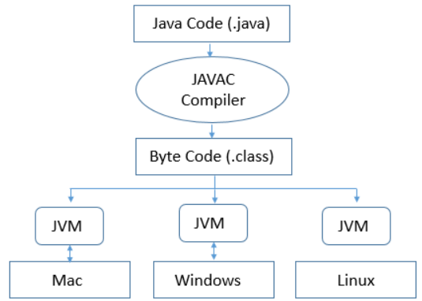

# JVM

## What is JVM?
Java Virtual Machine (JVM) is a system program that provides the services required for loading and executing class files with the extension class, which is the object module format of the Java platform, and its main task is to interpret the class files.

## How JVM works in java
JVM(Java Virtual Machine) acts as a runtime engine to run Java applications. JVM is the one that actually calls the main method present in a java code. JVM is a part of JRE(Java Runtime Environment). Java applications are called WORA (Write Once Run Anywhere).

## Java 8 changes in JVM
Class and metadata moved to MetaSpace. MetaSpace size max limit can be configured using JVM options. G1 starts supporting concurrent unloading of Classes. Code Cache is introduced.